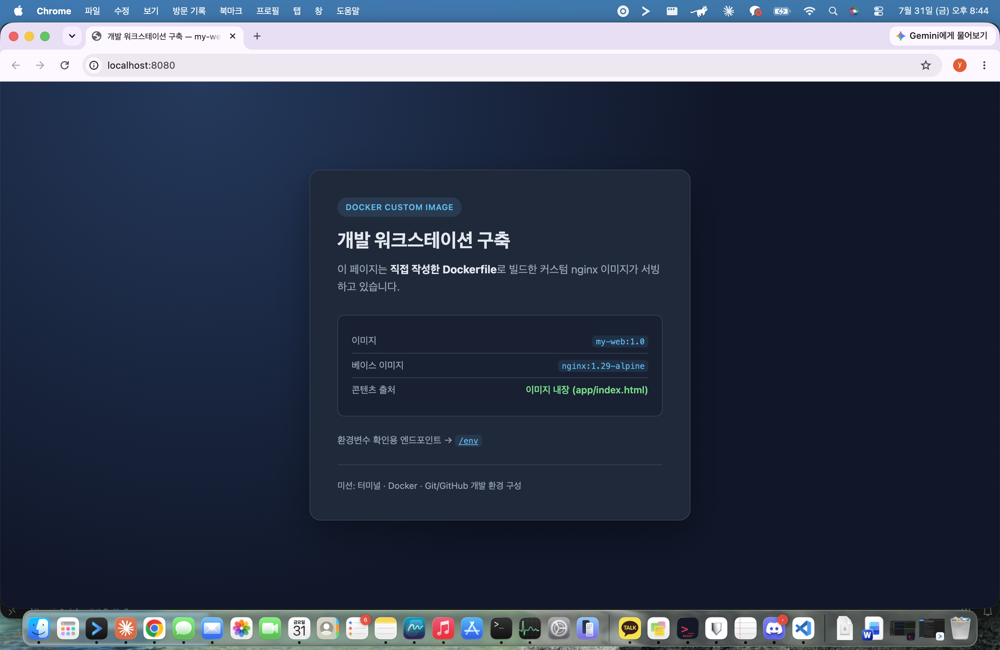
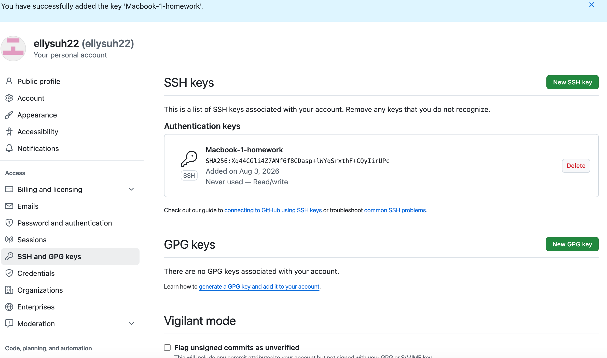
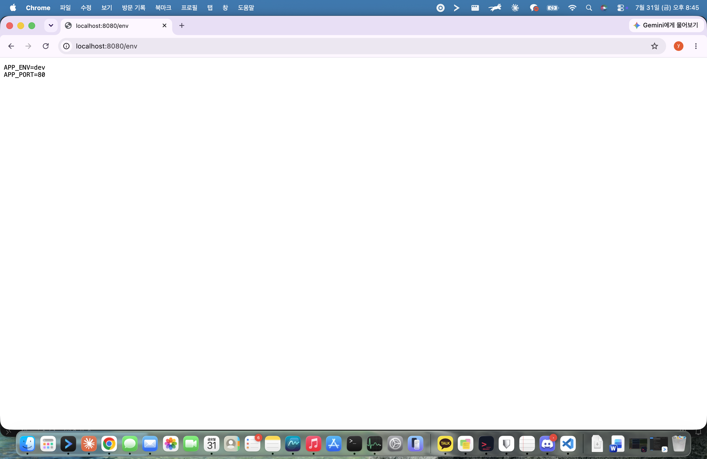
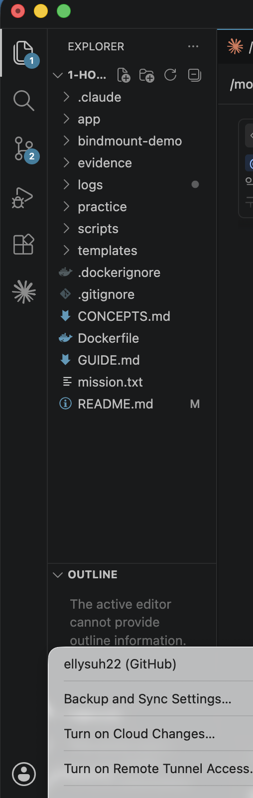

# 개발 워크스테이션 구축 — 터미널 · Docker · Git/GitHub

> **제출 저장소**: https://github.com/ellysuh22/1-homework
> **수행일**: 2026-07-31
> 이 문서 하나만 읽어도 전체 수행 내용을 파악하고, 동일한 절차로 재현할 수 있도록 작성했습니다.

> 📄 **평가자께**: 이 문서는 명령어와 출력을 그대로 담은 **증거 문서**입니다.
> 어떤 판단으로 이렇게 만들었는지에 대한 설명은 **[REPORT.md — 수행 보고서](REPORT.md)** 에 줄글로 정리했습니다. 그쪽을 먼저 읽으시면 전체 그림을 잡으신 뒤 이 문서에서 근거를 확인하실 수 있습니다.

---

## 1. 프로젝트 개요

코드가 "내 컴퓨터에서만" 돌아가는 문제를 없애고, 팀원 누구나 같은 방식으로 실행·배포·디버깅할 수 있는 개발 환경을 구성하는 미션입니다.

리눅스 CLI(터미널)로 작업 디렉토리와 권한을 다루고, Docker로 실행 환경 자체를 이미지에 담아 컨테이너로 띄우며, Git/GitHub로 결과물을 버전 관리·공유합니다. 단순히 명령을 따라 치는 것이 아니라 **포트 매핑·바인드 마운트·볼륨이 왜 필요한지를 실행 결과로 직접 증명**하는 것이 목표입니다.

---

## 2. 실행 환경

| 항목 | 값 | 확인 명령 |
|---|---|---|
| OS | macOS 26.5.2 (Build 25F84) | `sw_vers` |
| 쉘(Shell) | zsh (`/bin/zsh`) | `echo $SHELL` |
| 터미널 | VS Code 통합 터미널 | — |
| 컨테이너 런타임 | **OrbStack** | `docker context ls` |
| Docker | 29.4.0 (build 9d7ad9f) | `docker --version` |
| Docker Compose | v5.1.2 | `docker compose version` |
| Git | 2.55.0 | `git --version` |

### OrbStack을 쓰는 이유

macOS에는 리눅스 커널이 없어 Docker를 그대로 실행할 수 없습니다. 내부적으로 경량 리눅스 VM을 띄워야 하는데, 서울캠퍼스 환경은 보안 정책상 `sudo` 사용이 제한되어 Docker Desktop 설치·데몬 제어가 어렵습니다. **OrbStack은 관리자 권한 없이도 Docker 엔진을 구동**해주므로 이 제약을 우회할 수 있습니다. 앱을 실행하면 터미널에서는 `docker run`, `docker build` 등을 평소와 **완전히 동일하게** 사용합니다.

```bash
$ docker context ls
NAME         DESCRIPTION                               DOCKER ENDPOINT                                   ERROR
default      Current DOCKER_HOST based configuration   unix:///var/run/docker.sock
orbstack *   OrbStack                                  unix:///Users/ellysuh/.orbstack/run/docker.sock
```

`orbstack *` 의 `*` 가 현재 활성 컨텍스트임을 뜻합니다. → 전체 로그: [logs/03-docker-check.log](logs/03-docker-check.log)

---

## 3. 수행 항목 체크리스트

### 3-1. 필수 항목

- [x] **터미널** 기본 조작 9종 (위치확인·목록·이동·생성·복사·이름변경·삭제·내용확인·빈파일)
- [x] **권한** 실습 — 파일 1개 + 디렉토리 1개, 변경 전/후 비교 + 실효성 검증
- [x] **Docker** 설치 점검 (`docker --version`, `docker info`) 및 기본 운영 명령
- [x] **Dockerfile** 직접 작성 → 커스텀 이미지 빌드/실행 성공
- [x] **포트** 매핑 2회(8080·8081) + 브라우저 접속 증거(주소창 포함)
- [x] **마운트** — 바인드 마운트로 호스트 변경 즉시 반영 검증
- [x] **볼륨** — 컨테이너 삭제 전/후 데이터 유지 증명 (대조군 포함)
- [x] **Git** 사용자 정보·기본 브랜치 설정 및 `git config --list` 기록
- [x] **GitHub** 저장소 연동 및 VSCode 연동

### 3-2. 보너스 항목 (선택 — 아래 중 **GitHub SSH 키**를 선택해 수행)

- [ ] Docker Compose 기초 (단일 서비스)
- [ ] Docker Compose 멀티 컨테이너 + 네트워크 통신
- [ ] Compose 운영 명령어 (`up`/`down`/`ps`/`logs`)
- [ ] 환경 변수로 서버 포트/모드 변경
- [x] **GitHub SSH 키 설정** — 키 등록 + 인증 동작 확인 + HTTPS→SSH 전환 ([19장](#19-보너스--github-ssh-키-설정))

> 보너스를 나중에 추가해도 기존 산출물은 수정되지 않도록 설계했습니다. 자세한 내용은 [17-3절](#17-3-보너스-확장을-고려한-설계)을 참고하세요. 실제로 SSH 키 항목을 추가할 때 **기존 장(6~18장)은 한 줄도 고치지 않았고**, 19장을 뒤에 붙이는 것으로 끝났습니다.

---

## 4. 검증 방법 및 증거 위치

| 검증 항목 | 검증 명령 | 기대 결과 | 증거 |
|---|---|---|---|
| 터미널 9종 조작 | `pwd` `ls -la` `cd` `mkdir` `cp` `mv` `rm` `cat` `touch` | 각 명령 정상 수행 | [logs/01-terminal.log](logs/01-terminal.log) |
| 절대/상대 경로 차이 | `cat <절대경로>` vs `cat ./hello.txt` | 위치 이동 시 상대경로만 실패 | [logs/01-terminal.log](logs/01-terminal.log) |
| 권한 변경 | `chmod 600` → `ls -l` | `rw-r--r--` → `rw-------` | [logs/02-permissions.log](logs/02-permissions.log) |
| 권한 실효성 | `chmod 000` → `cat` | `Permission denied` | [logs/02-permissions.log](logs/02-permissions.log) |
| Docker 데몬 동작 | `docker info` | Server 섹션 정상 출력 | [logs/03-docker-check.log](logs/03-docker-check.log) |
| 이미지 다운로드 | `docker pull` | `Status: Downloaded newer image` | [logs/03-docker-check.log](logs/03-docker-check.log) |
| hello-world | `docker run hello-world` | `Hello from Docker!` | [logs/04-container-basics.log](logs/04-container-basics.log) |
| ubuntu 내부 진입 | `docker run -it ubuntu:24.04 bash` | 컨테이너 내부 프롬프트 진입 | [logs/04-container-basics.log](logs/04-container-basics.log) |
| attach vs exec | `docker exec` / `docker attach` | exec=Up 유지, attach+Ctrl+C=Exited(130) | [logs/04-container-basics.log](logs/04-container-basics.log) |
| 리소스 확인 | `docker stats --no-stream` | CPU/MEM 스냅샷 출력 | [logs/04-container-basics.log](logs/04-container-basics.log) |
| 이미지 빌드 | `docker build -t my-web:1.0 .` | `naming to docker.io/library/my-web:1.0` | [logs/05-image-build.log](logs/05-image-build.log) |
| 헬스체크 | `docker inspect --format '{{.State.Health.Status}}'` | `starting` → `healthy` | [logs/05-image-build.log](logs/05-image-build.log) |
| 포트 매핑 8080 | `curl -i http://localhost:8080` | `HTTP/1.1 200 OK` | [logs/06-port-mapping.log](logs/06-port-mapping.log) ·  |
| 포트 매핑 8081 | `curl -i http://localhost:8081` | `HTTP/1.1 200 OK` | [logs/06-port-mapping.log](logs/06-port-mapping.log) ·  |
| 바인드 마운트 | 호스트 파일 수정 후 `curl` | `v1` → `v2` 즉시 반영 | [logs/07-bind-mount.log](logs/07-bind-mount.log) |
| 볼륨 영속성 | `docker rm -f` 후 새 컨테이너에서 `cat` | 데이터 유지 | [logs/08-volume.log](logs/08-volume.log) |
| Git 설정 | `git config --list` | user.name/email/defaultBranch 확인 | [logs/09-git-github.log](logs/09-git-github.log) |
| SSH 인증 성공 *(보너스)* | `ssh -T git@github.com` | `Hi ellysuh22! You've successfully authenticated` | [logs/10-ssh-key.log](logs/10-ssh-key.log) |
| SSH 인증 실효성 *(보너스)* | 키 차단 후 `ssh -T` | `Permission denied (publickey).` | [logs/10-ssh-key.log](logs/10-ssh-key.log) |
| HTTPS→SSH 전환 *(보너스)* | `git remote -v` 전/후 | `https://...` → `git@github.com:...` | [logs/10-ssh-key.log](logs/10-ssh-key.log) |
| 키 등록 *(보너스)* | `ssh-keygen -lf` ↔ GitHub 화면 | 지문 `SHA256:Xq44…UPc` 일치 |  |

---

## 5. 저장소 구조

```
1-homework/
├── README.md                        # 이 문서 (모든 증거의 허브)
├── Dockerfile                       # 직접 작성한 커스텀 이미지 정의
├── .dockerignore / .gitignore
├── app/                             # 웹 서버 소스코드 (이미지에 COPY 되는 정적 콘텐츠)
│   ├── index.html
│   ├── style.css
│   └── 50x.html
├── templates/
│   └── default.conf.template        # nginx 서버 설정 (환경변수 치환 대상)
├── bindmount-demo/                  # 바인드 마운트 실습 전용 폴더
│   └── index.html
├── scripts/                         # 실습 수행 + 로그 수집 스크립트
│   ├── runlog.sh                    #   명령어+출력을 함께 기록하는 헬퍼
│   ├── 01-terminal.sh ~ 08-volume.sh
│   ├── 10-ssh-key.sh                #   (보너스) SSH 키 설정/검증 — setup·verify 2단계
│   └── 10b-ssh-push.sh              #   (보너스) SSH 경로로 실제 push 증거 수집
├── logs/                            # 터미널 조작 로그 (명령어 + 출력)
│   └── 01-terminal.log ~ 10-ssh-key.log
├── evidence/                        # 브라우저·GUI 스크린샷
├── mission.txt                      # 과제 원문
├── GUIDE.md                         # 단계별 실행 가이드 (부록)
└── CONCEPTS.md                      # 개념 해설 사전 (부록)
```

### 증거 수집 방식 — 명령어와 출력을 함께 남기기

미션은 "캡처/로그에는 **명령어 입력과 출력 결과가 함께** 포함되어야 한다"고 요구합니다. 사람이 손으로 복붙하면 명령어를 빠뜨리기 쉬우므로, [scripts/runlog.sh](scripts/runlog.sh)의 헬퍼 함수로 모든 실습을 실행해 **구조적으로 누락이 불가능**하게 만들었습니다.

```bash
logrun() {
  local out rc cmd
  cmd="$(_fmt_cmd "$@")"          # 공백 포함 인자를 따옴표까지 살려서 복원
  out=$("$@" 2>&1); rc=$?
  {
    printf '\n$ %s\n' "$cmd"      # 명령어 입력
    printf '%s\n' "$out"          # 출력 결과
    [ "$rc" -ne 0 ] && printf '[exit code: %s]\n' "$rc"
  } >> "$LOGFILE"
}
```

덕분에 모든 로그가 `$ 명령어` 다음 줄에 실제 출력이 오는 형태로 통일되며, **로그를 그대로 복붙하면 같은 명령이 재현**됩니다.

---

## 6. 터미널 조작 로그

미션이 요구한 9종 조작을 모두 수행했습니다. 전체 로그: [logs/01-terminal.log](logs/01-terminal.log)

### 6-1. 현재 위치 확인 · 목록 확인(숨김 파일 포함)

```bash
$ pwd
/Users/ellysuh/Documents/1-homework

$ ls -la
total 168
drwxr-xr-x@ 15 ellysuh  staff    480 Jul 31 20:29 .
drwx------@ 28 ellysuh  staff    896 Jul 31 15:35 ..
-rw-r--r--@  1 ellysuh  staff   1207 Jul 31 20:26 .dockerignore
drwxr-xr-x@  9 ellysuh  staff    288 Jul 31 20:10 .git
-rw-r--r--@  1 ellysuh  staff    528 Jul 31 20:26 .gitignore
-rw-r--r--@  1 ellysuh  staff  39015 Jul 30 20:48 CONCEPTS.md
-rw-r--r--@  1 ellysuh  staff   4800 Jul 31 20:26 Dockerfile
...
```

`-a` 옵션을 빼면 `.` 으로 시작하는 숨김 파일(`.git`, `.gitignore`, `.dockerignore`)이 보이지 않습니다.

```bash
$ ls
CONCEPTS.md	Dockerfile	GUIDE.md	app		bindmount-demo
evidence	logs		mission.txt	scripts		templates
```

### 6-2. 생성 · 빈 파일 · 내용 확인

```bash
$ mkdir -p practice/docs practice/backup

$ touch practice/empty-note.txt

$ ls -l practice/empty-note.txt
-rw-r--r--@ 1 ellysuh  staff  0 Jul 31 20:29 practice/empty-note.txt      # 크기 0바이트

$ printf "첫 번째 줄입니다.\n두 번째 줄입니다.\n" > practice/hello.txt

$ cat practice/hello.txt
첫 번째 줄입니다.
두 번째 줄입니다.
```

### 6-3. 복사 · 이름변경 · 이동 · 삭제

```bash
$ cp practice/hello.txt practice/backup/hello-copy.txt

$ mv practice/backup/hello-copy.txt practice/backup/hello-renamed.txt   # 같은 폴더 → 이름변경

$ mv practice/empty-note.txt practice/docs/                             # 다른 폴더 → 이동

$ rm practice/backup/hello-renamed.txt                                  # 파일 삭제

$ rm -r practice/backup                                                 # 폴더째 삭제

$ ls -la practice
total 8
drwxr-xr-x@  4 ellysuh  staff  128 Jul 31 20:29 .
drwxr-xr-x@ 16 ellysuh  staff  512 Jul 31 20:29 ..
drwxr-xr-x@  3 ellysuh  staff   96 Jul 31 20:29 docs
-rw-r--r--@  1 ellysuh  staff   50 Jul 31 20:29 hello.txt
```

### 6-4. 이동 — 절대 경로 vs 상대 경로 실증

같은 파일을 두 방식으로 접근하면 결과가 **동일**합니다.

```bash
$ cd /Users/ellysuh/Documents/1-homework/practice/docs     # 절대 경로로 이동
$ pwd
/Users/ellysuh/Documents/1-homework/practice/docs

$ cd ..                                                     # 상대 경로로 이동 (.. = 부모)
$ pwd
/Users/ellysuh/Documents/1-homework/practice

$ cat /Users/ellysuh/Documents/1-homework/practice/hello.txt   # 절대 경로
첫 번째 줄입니다.
두 번째 줄입니다.

$ cat ./hello.txt                                              # 상대 경로 — 결과 동일
첫 번째 줄입니다.
두 번째 줄입니다.
```

그러나 **현재 위치가 바뀌면 상대 경로만 실패**합니다. 이것이 두 방식의 결정적 차이입니다.

```bash
$ cd /Users/ellysuh/Documents/1-homework/practice/docs      # 한 단계 아래로 이동
$ pwd
/Users/ellysuh/Documents/1-homework/practice/docs

$ cat ./hello.txt
cat: ./hello.txt: No such file or directory                 # ← 같은 명령인데 이번엔 실패
[exit code: 1]
```

---

## 7. 파일 권한 실습

파일 1개(`perm-test.txt`)와 디렉토리 1개(`perm-demo`)에 대해 실험했습니다. 전체 로그: [logs/02-permissions.log](logs/02-permissions.log)

### 7-1. 변경 전 / 변경 후 비교

```bash
### === 변경 전 ===
$ ls -l practice/perm-test.txt
-rw-r--r--@ 1 ellysuh  staff  34 Jul 31 20:30 practice/perm-test.txt     # 644

$ ls -ld practice/perm-demo
drwxr-xr-x@ 3 ellysuh  staff  96 Jul 31 20:30 practice/perm-demo         # 755

### 파일: 644 → 600 으로 변경
$ chmod 600 practice/perm-test.txt
$ ls -l practice/perm-test.txt
-rw-------@ 1 ellysuh  staff  34 Jul 31 20:30 practice/perm-test.txt     # ← 뒤 6글자가 잠김

### 디렉토리: 755 → 700 으로 변경
$ chmod 700 practice/perm-demo
$ ls -ld practice/perm-demo
drwx------@ 3 ellysuh  staff  96 Jul 31 20:30 practice/perm-demo         # ← 진입 권한 회수

### 표준 권한으로 복구
$ chmod 644 practice/perm-test.txt
$ chmod 755 practice/perm-demo
```

### 7-2. 권한이 실제로 작동하는지 검증

표기만 바뀐 것이 아니라 실제로 접근이 차단되는지 확인했습니다.

```bash
$ chmod 000 practice/perm-test.txt
$ ls -l practice/perm-test.txt
----------  1 ellysuh  staff  34 Jul 31 20:30 practice/perm-test.txt

$ cat practice/perm-test.txt
cat: practice/perm-test.txt: Permission denied              # ← 소유자인데도 막힌다
[exit code: 1]

$ chmod 644 practice/perm-test.txt                          # 복구하면
$ cat practice/perm-test.txt
권한 실습용 파일입니다.                                       # ← 다시 읽힌다
```

디렉토리의 `x`(실행) 권한은 "진입 권한"이라는 것도 확인했습니다.

```bash
$ chmod 644 practice/perm-demo                              # x 를 제거
$ ls -ld practice/perm-demo
drw-r--r--@ 3 ellysuh  staff  96 Jul 31 20:30 practice/perm-demo

$ ls practice/perm-demo
ls: fts_read: Permission denied                             # ← 폴더에 들어갈 수 없다
[exit code: 1]

$ chmod 755 practice/perm-demo                              # 복구
$ ls practice/perm-demo
inside.txt
```

---

## 8. Docker 설치 점검 및 기본 운영 명령

전체 로그: [logs/03-docker-check.log](logs/03-docker-check.log) · [logs/04-container-basics.log](logs/04-container-basics.log)

### 8-1. 설치 및 데몬 동작 확인

```bash
$ docker --version
Docker version 29.4.0, build 9d7ad9f

$ docker info
Client:
 Version:    29.4.0
 Context:    orbstack
 Plugins:
  buildx: v0.33.0
  compose: v5.1.2
Server:                                    # ← Server 섹션이 뜨면 데몬이 살아있다는 뜻
 Containers: 0 (Running 0 / Paused 0 / Stopped 0)
 Images: 0
 Server Version: 29.4.0
 Storage Driver: overlayfs
 Cgroup Driver: cgroupfs / Cgroup Version: 2
```

### 8-2. 이미지 다운로드 및 목록 확인

```bash
$ docker pull hello-world
Using default tag: latest
latest: Pulling from library/hello-world
58dee6a49ef1: Pull complete
Status: Downloaded newer image for hello-world:latest

$ docker pull ubuntu:24.04
24.04: Pulling from library/ubuntu
4b987da45db4: Pull complete
Status: Downloaded newer image for ubuntu:24.04

$ docker pull nginx:1.29-alpine
1.29-alpine: Pulling from library/nginx
Status: Downloaded newer image for nginx:1.29-alpine

$ docker images
IMAGE                ID             DISK USAGE   CONTENT SIZE
hello-world:latest   c3cbe1cc1aa5       18.5kB         10.3kB
my-web:1.0           7110d4e5fcaa       93.1MB         25.8MB
nginx:1.29-alpine    5616878291a2         94MB         26.7MB
ubuntu:24.04         4fbb8e6a8395        139MB         30.8MB
```

### 8-3. 컨테이너 실행 / 중지 / 목록 / 로그 / 리소스

```bash
$ docker ps                     # 실행 중인 것만
CONTAINER ID   IMAGE          COMMAND                  STATUS         PORTS      NAMES
49f080fd5fbe   ubuntu:24.04   "sh -c 'i=1; while t…"   Up 3 seconds              tick-demo

$ docker ps -a                  # 종료된 것까지 전체

$ docker logs --tail 5 tick-demo
tick 4
tick 5
tick 6
tick 7
tick 8

$ docker stats --no-stream      # 실시간 갱신 모드라 --no-stream 으로 스냅샷 1회만
CONTAINER ID   NAME        CPU %   MEM USAGE / LIMIT    MEM %   NET I/O         BLOCK I/O   PIDS
49f080fd5fbe   tick-demo   0.10%   832KiB / 11.74GiB    0.01%   1.13kB / 126B   0B / 0B     2

$ docker stop tick-demo
tick-demo

$ docker ps -a --filter name=tick-demo --format 'table {{.Names}}\t{{.Status}}'
NAMES       STATUS
tick-demo   Exited (137) Less than a second ago
```

---

## 9. 컨테이너 실행 실습

### 9-1. hello-world

```bash
$ docker run --name hello-test hello-world

Hello from Docker!
This message shows that your installation appears to be working correctly.

To generate this message, Docker took the following steps:
 1. The Docker client contacted the Docker daemon.
 2. The Docker daemon pulled the "hello-world" image from the Docker Hub.
    (arm64v8)
 3. The Docker daemon created a new container from that image which runs the
    executable that produces the output you are currently reading.
 4. The Docker daemon streamed that output to the Docker client, which sent it
    to your terminal.
```

### 9-2. ubuntu 컨테이너 내부 진입

`-i`(입력 유지) + `-t`(가상 터미널 할당) 옵션으로 컨테이너 안에 직접 들어갔습니다. 아래 `bash-5.2#` 이 **컨테이너 내부 프롬프트**입니다.

```bash
$ docker run -it --rm --name ubuntu-lab ubuntu:24.04 bash
bash-5.2# pwd
/
bash-5.2# ls
bin   dev  home  media  opt   root  sbin  sys  usr
boot  etc  lib   mnt    proc  run   srv   tmp  var
bash-5.2# echo "hello from ubuntu container"
hello from ubuntu container
bash-5.2# whoami
root
bash-5.2# cat /etc/os-release
PRETTY_NAME="Ubuntu 24.04.4 LTS"
NAME="Ubuntu"
VERSION_ID="24.04"
VERSION="24.04.4 LTS (Noble Numbat)"
bash-5.2# exit
exit
```

> 이 대화형 세션은 macOS 내장 `script` 명령으로 가상 터미널을 할당해 그대로 기록했습니다. 자세한 방법은 [scripts/04-container-basics.sh](scripts/04-container-basics.sh)의 `log_tty()` 함수를 참고하세요.

### 9-3. 컨테이너 종료/유지의 차이 — attach vs exec 관찰

1초마다 숫자를 출력하는 컨테이너를 띄워두고 세 가지 방법으로 접근해 비교했습니다.

**① `docker logs` — 밖에서 출력만 열람 (컨테이너에 영향 없음)**

```bash
$ docker logs tick-demo
tick 1
tick 2
tick 3
tick 4
tick 5

$ docker ps --filter name=tick-demo --format 'table {{.Names}}\t{{.Status}}'
NAMES       STATUS
tick-demo   Up 4 seconds
```

**② `docker exec` — 새로운 별도 세션을 하나 더 열기**

```bash
$ docker exec tick-demo sh -c 'echo "exec 로 들어와서 실행한 명령입니다"; echo "---"; ls /'
exec 로 들어와서 실행한 명령입니다
---
bin
boot
dev
...

$ docker ps --filter name=tick-demo --format 'table {{.Names}}\t{{.Status}}'
NAMES       STATUS
tick-demo   Up 4 seconds                 # ← 빠져나와도 컨테이너는 그대로 살아있다
```

**③ `docker attach` — 메인 프로세스 화면에 직접 연결**

```bash
$ docker attach tick-demo
tick 6
tick 7
tick 8
^C          <-- 3초 뒤 Ctrl+C 로 빠져나옴

$ docker ps -a --filter name=tick-demo --format 'table {{.Names}}\t{{.Status}}'
NAMES       STATUS
tick-demo   Exited (130) 2 seconds ago   # ← 컨테이너가 함께 종료됐다
```

#### 관찰 정리

- **`exec`는 "새 문을 하나 더 내고 들어가는 것"** 입니다. 컨테이너의 메인 프로세스와 별개인 프로세스를 실행하므로, 작업을 마치고 나와도 컨테이너는 계속 살아있습니다(`Up`).
- **`attach`는 "이미 열려 있는 문으로 들어가 같은 화면을 보는 것"** 입니다. 메인 프로세스의 입출력에 직접 연결되기 때문에, 여기서 `Ctrl+C`를 누르면 그 신호가 메인 프로세스에 전달되어 **컨테이너까지 함께 종료**됩니다. 종료 코드 `130`은 `128 + 2(SIGINT)`로, Ctrl+C 때문에 죽었음을 뜻합니다.
- 따라서 **실행 중인 컨테이너를 건드리지 않고 안전하게 들어가려면 `exec`를 써야 합니다.** 로그만 볼 목적이라면 아예 들어갈 필요 없이 `docker logs`가 가장 안전합니다.

---

## 10. 커스텀 이미지 제작

전체 로그: [logs/05-image-build.log](logs/05-image-build.log)

### 10-1. 선택한 방식과 베이스 이미지

미션이 제시한 두 방식 중 **(A) 웹 서버 베이스 이미지 활용 + 정적 콘텐츠/설정 교체**를 선택했습니다.

| 항목 | 내용 |
|---|---|
| 베이스 이미지 | `nginx:1.29-alpine` |
| 선택 이유 | ① 웹서버가 이미 설치돼 있어 포트 매핑·바인드 마운트 검증이 즉시 가능 ② alpine 기반이라 이미지가 가볍고 빌드가 빠름 ③ 패키지 설치 단계가 없어 네트워크 문제로 빌드가 깨질 위험이 낮음 |
| 태그 고정 이유 | `nginx:alpine` 같은 움직이는 태그를 쓰면 나중에 빌드할 때 다른 버전이 받아져 결과가 달라집니다. **재현 가능한 환경**을 위해 마이너 버전까지 고정했습니다. |

### 10-2. 커스텀 포인트와 각각의 목적

| # | Dockerfile 지시어 | 적용한 내용 | 목적 |
|---|---|---|---|
| ① | `LABEL` | 이미지 제목·설명·버전 | 이미지가 쌓였을 때 출처를 추적할 수 있게 메타데이터를 새김 |
| ② | `ARG` / `ENV` | `APP_PORT=80`, `APP_ENV=dev`, `NGINX_ENVSUBST_FILTER` | **설정을 코드에서 분리**. 이미지를 다시 빌드하지 않고 실행 시점에 포트·모드를 바꿀 수 있게 함 |
| ③ | `COPY app/` | nginx 기본 페이지 → 내가 만든 페이지 | **정적 콘텐츠 교체** (미션 (A) 방식의 핵심 요구) |
| ④ | `COPY templates/` | nginx 서버 설정을 템플릿으로 주입 | **설정 교체**. 원본 `default.conf`는 `listen 80`이 하드코딩돼 환경변수로 못 바꾸므로 템플릿으로 대체 |
| ⑤ | `EXPOSE` | 사용 포트 선언 | 이 컨테이너가 어떤 포트를 쓰는지 문서화 (실제 공개는 `-p`가 담당 — [15-4절](#15-4-포트-매핑이-필요한-이유) 참고) |
| ⑥ | `HEALTHCHECK` | 10초마다 자체 HTTP 요청 | "떠 있는 것"과 "정상 응답하는 것"을 구분. `wget` 사용 (alpine에는 `curl`이 없음) |

### 10-3. Dockerfile 전문

```dockerfile
FROM nginx:1.29-alpine

# [커스텀 ①] 이미지 메타데이터
LABEL org.opencontainers.image.title="my-web" \
      org.opencontainers.image.description="개발 워크스테이션 구축 미션 - 커스텀 nginx 이미지" \
      org.opencontainers.image.version="1.0"

# [커스텀 ②] 설정값을 코드에서 분리 (ARG → ENV)
ARG APP_PORT=80
ARG APP_ENV=dev
ENV APP_PORT=${APP_PORT} \
    APP_ENV=${APP_ENV} \
    NGINX_ENVSUBST_FILTER="^APP_"

# [커스텀 ③] 정적 콘텐츠 교체
COPY app/ /usr/share/nginx/html/

# [커스텀 ④] 서버 설정 교체 (템플릿 주입)
COPY templates/ /etc/nginx/templates/

# [커스텀 ⑤] 사용 포트 선언
EXPOSE ${APP_PORT}

# [커스텀 ⑥] 헬스체크 — alpine에는 curl이 없으므로 busybox wget 사용
#            shell 형식으로 써야 ${APP_PORT}가 실행 시점에 확장된다
HEALTHCHECK --interval=10s --timeout=3s --start-period=5s --retries=3 \
  CMD wget -q -O /dev/null "http://127.0.0.1:${APP_PORT}/" || exit 1
```

> 전체 주석 포함 원본: [Dockerfile](Dockerfile)
> **주의**: `CMD`는 베이스 이미지 기본값을 그대로 물려받아야 합니다. nginx 공식 엔트리포인트는 첫 인자가 `nginx`일 때만 `/docker-entrypoint.d/*.sh`를 실행하는데, `CMD`를 덮어쓰면 템플릿 치환이 **에러 없이 조용히 건너뛰어집니다.**

### 10-4. 빌드 및 실행

```bash
$ docker build --progress=plain -t my-web:1.0 .
#1 [internal] load build definition from Dockerfile
#1 transferring dockerfile: 4.84kB done
#5 [1/3] FROM docker.io/library/nginx:1.29-alpine@sha256:5616878291a2...
#6 [2/3] COPY app/ /usr/share/nginx/html/
#6 DONE 0.0s
#7 [3/3] COPY templates/ /etc/nginx/templates/
#7 DONE 0.0s
#8 exporting to image
#8 naming to docker.io/library/my-web:1.0 done
#8 DONE 0.2s

$ docker run -d -p 8080:80 --name web-8080 my-web:1.0
4c2bb7cf62dceb8a2a6b04ad46668b9b49c54145390cd1b9d67a8110ebdf1948
```

### 10-5. 커스텀 포인트가 실제로 반영됐는지 검증

```bash
$ docker inspect my-web:1.0 --format '{{json .Config.Labels}}'
{"org.opencontainers.image.description":"개발 워크스테이션 구축 미션 - 커스텀 nginx 이미지",
 "org.opencontainers.image.title":"my-web","org.opencontainers.image.version":"1.0"}

$ docker inspect my-web:1.0 --format '{{range .Config.Env}}{{println .}}{{end}}'
APP_PORT=80
APP_ENV=dev
NGINX_ENVSUBST_FILTER=^APP_

$ docker inspect my-web:1.0 --format '{{json .Config.Healthcheck}}'
{"Test":["CMD-SHELL","wget -q -O /dev/null \"http://127.0.0.1:${APP_PORT}/\" || exit 1"],
 "Interval":10000000000,"Timeout":3000000000,"StartPeriod":5000000000,"Retries":3}
```

**헬스체크가 실제로 통과하는지** 확인했습니다.

```bash
$ docker inspect web-8080 --format 'Health: {{.State.Health.Status}}'
Health: starting

# 10초 뒤
$ docker inspect web-8080 --format 'Health: {{.State.Health.Status}}'
Health: healthy

$ docker ps --filter name=web-8080
CONTAINER ID   IMAGE        STATUS                    PORTS                     NAMES
4c2bb7cf62dc   my-web:1.0   Up 12 seconds (healthy)   0.0.0.0:8080->80/tcp      web-8080
```

**설정 템플릿이 치환됐는지** 확인했습니다. 템플릿의 `${APP_PORT}`가 실제 값 `80`으로 바뀌어 새 설정 파일이 생성됐습니다.

```bash
$ docker exec web-8080 cat /etc/nginx/conf.d/default.conf
server {
    listen       80;                       # ← ${APP_PORT} 가 치환됨
    server_name  localhost;

    add_header X-App-Env  "dev"  always;   # ← ${APP_ENV} 가 치환됨
    add_header X-App-Port "80" always;
    ...
}

$ docker logs web-8080
/docker-entrypoint.sh: Launching /docker-entrypoint.d/20-envsubst-on-templates.sh
20-envsubst-on-templates.sh: Running envsubst on /etc/nginx/templates/default.conf.template
                             to /etc/nginx/conf.d/default.conf
2026/07/31 11:36:43 [notice] 1#1: nginx/1.29.8
2026/07/31 11:36:43 [notice] 1#1: start worker processes
```

---

## 11. 포트 매핑 및 접속 증거

전체 로그: [logs/06-port-mapping.log](logs/06-port-mapping.log)

### 11-1. 같은 이미지로 2개의 컨테이너를 서로 다른 포트에 실행

```bash
$ docker run -d -p 8080:80 --name web-8080 my-web:1.0
$ docker run -d -p 8081:80 --name web-8081 my-web:1.0

$ docker ps --format 'table {{.Names}}\t{{.Ports}}\t{{.Status}}'
NAMES      PORTS                                     STATUS
web-8081   0.0.0.0:8081->80/tcp, [::]:8081->80/tcp   Up 5 seconds (healthy)
web-8080   0.0.0.0:8080->80/tcp, [::]:8080->80/tcp   Up About a minute (healthy)
```

이미지는 하나지만 컨테이너는 여러 개 만들 수 있습니다. (붕어빵 틀 : 붕어빵의 관계)

### 11-2. curl 응답 확인

```bash
$ curl -sS -i http://localhost:8080
HTTP/1.1 200 OK
Server: nginx/1.29.8
Content-Type: text/html
Content-Length: 1176
X-App-Env: dev
X-App-Port: 80
...

$ curl -sS -i http://localhost:8081
HTTP/1.1 200 OK
...
```

두 응답이 완전히 동일한 내용인지 해시로 확인했습니다.

```bash
$ curl -sS http://localhost:8080 | shasum -a 256
ffbea74a8cc62ed02dac1e7fd3266566a3a1612da8338a87a7f47e357140327b  -

$ curl -sS http://localhost:8081 | shasum -a 256
ffbea74a8cc62ed02dac1e7fd3266566a3a1612da8338a87a7f47e357140327b  -   # 동일
```

### 11-3. 브라우저 접속 증거 (주소창 + 응답 화면)

**포트 8080** — 주소창의 `localhost:8080` 과 응답 화면이 함께 보입니다.


**포트 8081**


**환경변수 확인용 `/env` 엔드포인트** — 설정이 코드와 분리되어 주입됐음을 보여줍니다.



### 11-4. 포트 충돌 실험

호스트의 한 포트는 한 프로세스만 쓸 수 있습니다. 이미 8080을 쓰는 상태에서 또 8080을 요청하면 실패합니다.

```bash
$ docker run -d -p 8080:80 --name web-conflict my-web:1.0
docker: Error response from daemon: failed to set up container networking:
driver failed programming external connectivity on endpoint web-conflict:
Bind for 0.0.0.0:8080 failed: port is already allocated
[exit code: 125]
```

---

## 12. 바인드 마운트 반영 증거

전체 로그: [logs/07-bind-mount.log](logs/07-bind-mount.log)

호스트의 폴더를 컨테이너 안 경로에 그대로 연결하고, **호스트에서 파일을 고치면 재빌드·재시작 없이 즉시 반영되는지** 확인했습니다.

### 12-1. 실행 명령

```bash
$ docker run -d -p 8082:80 \
    -v /Users/ellysuh/Documents/1-homework/bindmount-demo:/usr/share/nginx/html \
    --name web-bind my-web:1.0

$ docker inspect web-bind --format '{{range .Mounts}}Type={{.Type}}  Source={{.Source}}  Destination={{.Destination}}{{println}}{{end}}'
Type=bind  Source=/Users/ellysuh/Documents/1-homework/bindmount-demo  Destination=/usr/share/nginx/html
```

`Type=bind` 인 것에 주목하세요. (볼륨은 `Type=volume`으로 표시됩니다.)

### 12-2. 호스트 변경 전 / 후 비교

```bash
### === 변경 전 ===
$ curl -sS http://localhost:8082 | grep -E "ver\">|수정"
    <p class="ver">v1</p>
    <p>수정 전 상태</p>

$ docker exec web-bind grep -o "v1" /usr/share/nginx/html/index.html
v1

### *** 호스트에서 파일 수정 (컨테이너는 건드리지 않음, 재빌드/재시작 없음) ***
$ sed -i '' 's|>v1<|>v2<|; s|수정 전 상태|수정 후 상태 (호스트에서 방금 고침)|' bindmount-demo/index.html

### === 변경 후 === 곧바로 다시 요청
$ curl -sS http://localhost:8082 | grep -E "ver\">|수정"
    <p class="ver">v2</p>                              # ← 즉시 반영됨
    <p>수정 후 상태 (호스트에서 방금 고침)</p>

$ docker exec web-bind grep -o "v2" /usr/share/nginx/html/index.html
v2                                                     # ← 컨테이너 안에서도 바뀜
```

### 12-3. 대조 — 바인드 마운트를 걸지 않은 컨테이너

```bash
$ curl -sS http://localhost:8080 | grep -o "이미지 내장 (app/index.html)"
이미지 내장 (app/index.html)                            # ← 이미지에 구운 콘텐츠 그대로
```

> **결론**: 바인드 마운트를 걸면 호스트 파일 수정이 컨테이너에 **즉시** 반영됩니다. 이미지를 다시 빌드하거나 컨테이너를 재시작할 필요가 없어, 개발 중 코드를 고쳐가며 확인할 때 유용합니다. 또한 마운트는 컨테이너의 해당 경로를 **덮어쓰기** 때문에, 이미지에 들어있던 `app/index.html`은 가려지고 호스트 파일이 보이게 됩니다.

---

## 13. 볼륨 영속성 증거

전체 로그: [logs/08-volume.log](logs/08-volume.log)

볼륨이 데이터를 지켜준다는 것을 증명하기 위해 **실험군(볼륨 사용)과 대조군(볼륨 미사용)을 나란히** 수행했습니다.

### 13-1. 실험 A — 볼륨 사용 시 데이터가 유지된다

```bash
### 볼륨 생성 및 연결
$ docker volume create my-data
my-data

$ docker volume ls
DRIVER    VOLUME NAME
local     my-data

$ docker run -d --name vol-test -v my-data:/data ubuntu:24.04 sleep infinity

$ docker inspect vol-test --format '{{range .Mounts}}Type={{.Type}}  Name={{.Name}}  Destination={{.Destination}}{{println}}{{end}}'
Type=volume  Name=my-data  Destination=/data

### 데이터 기록
$ docker exec vol-test bash -c 'echo "이 데이터는 볼륨에 저장됩니다." > /data/hello.txt; date "+기록 시각: %Y-%m-%d %H:%M:%S" >> /data/hello.txt; cat /data/hello.txt'
이 데이터는 볼륨에 저장됩니다.
기록 시각: 2026-07-31 11:42:47

### === 컨테이너 삭제 전 ===
$ docker exec vol-test cat /data/hello.txt
이 데이터는 볼륨에 저장됩니다.
기록 시각: 2026-07-31 11:42:47

### *** 컨테이너를 완전히 삭제 ***
$ docker rm -f vol-test
vol-test

$ docker ps -a --filter name=vol-test
CONTAINER ID   IMAGE     COMMAND   CREATED   STATUS    PORTS     NAMES      # 없음

$ docker volume ls
DRIVER    VOLUME NAME
local     my-data                                       # ← 볼륨은 그대로 남아있다

### === 컨테이너 삭제 후 === 새 컨테이너에 같은 볼륨 연결
$ docker run -d --name vol-test2 -v my-data:/data ubuntu:24.04 sleep infinity

$ docker exec vol-test2 cat /data/hello.txt
이 데이터는 볼륨에 저장됩니다.
기록 시각: 2026-07-31 11:42:47                          # ← 기록 시각까지 그대로 살아있다
```

### 13-2. 실험 B — 대조군: 볼륨 없이 하면 데이터가 사라진다

```bash
$ docker run -d --name novol-test ubuntu:24.04 sleep infinity

$ docker exec novol-test bash -c 'echo "이 데이터는 컨테이너 안에만 있습니다." > /data-inside.txt; cat /data-inside.txt'
이 데이터는 컨테이너 안에만 있습니다.

### *** 컨테이너 삭제 ***
$ docker rm -f novol-test

### 같은 이미지로 새 컨테이너를 띄워 같은 파일을 찾아보면
$ docker run -d --name novol-test2 ubuntu:24.04 sleep infinity
$ docker exec novol-test2 cat /data-inside.txt
cat: /data-inside.txt: No such file or directory        # ← 데이터가 사라졌다
[exit code: 1]
```

> **결론**: 두 실험의 유일한 차이는 볼륨 연결 여부입니다. 실험 A는 컨테이너를 지웠는데도 기록 시각까지 그대로 살아남았고, 실험 B는 완전히 사라졌습니다. 따라서 **데이터를 지켜준 것이 볼륨**임이 증명됩니다.

---

## 14. Git 설정 및 GitHub / VSCode 연동

전체 로그: [logs/09-git-github.log](logs/09-git-github.log)

### 14-1. Git 사용자 정보 및 기본 브랜치 설정

```bash
$ git --version
git version 2.55.0

$ git config --global user.name "ellysuh22"
$ git config --global user.email "youngsuh0630@gmail.com"
$ git config --global init.defaultBranch main
```

### 14-2. `git config --list` 결과

```bash
$ git config --list
credential.helper=osxkeychain
credential.https://github.com.helper=!/opt/homebrew/bin/gh auth git-credential
user.name=ellysuh22
user.email=youngsuh0630@gmail.com
init.defaultbranch=main
core.repositoryformatversion=0
core.filemode=true
core.bare=false
core.logallrefupdates=true
core.ignorecase=true
core.precomposeunicode=true
remote.origin.url=https://github.com/ellysuh22/1-homework.git
remote.origin.fetch=+refs/heads/*:refs/remotes/origin/*
branch.main.remote=origin
branch.main.merge=refs/heads/main
```

> `credential.helper` 항목은 인증을 처리할 **프로그램 경로**만 기록되고 토큰 값 자체는 저장되지 않습니다. 토큰은 macOS 키체인에 별도 보관됩니다.

### 14-3. GitHub 저장소 연동

```bash
$ git remote -v
origin	https://github.com/ellysuh22/1-homework.git (fetch)
origin	https://github.com/ellysuh22/1-homework.git (push)
```

저장소 소유자 계정으로 인증한 뒤 쓰기 권한을 확인했습니다.

```bash
$ gh auth status
github.com
  ✓ Logged in to github.com account ellysuh22 (keyring)
  - Active account: true
  - Git operations protocol: https
  - Token: gho_************************************      # gh 가 자동 마스킹

$ gh api repos/ellysuh22/1-homework --jq '.permissions'
{"admin":true,"maintain":true,"pull":true,"push":true,"triage":true}
```

### 14-4. 커밋 및 업로드

작업 단위를 나누어 5개 커밋으로 정리했습니다.

```bash
$ git log --oneline
bbfbb8f docs: 기술 문서(README) 작성
b5a3f2b docs: 브라우저 접속 증거 스크린샷 (주소창 포함)
ccd5f54 docs: 터미널/권한/Docker/컨테이너/이미지/포트/마운트/볼륨 실습 로그
af71e03 feat: 실습 수행 및 로그 수집 스크립트
fad1256 chore: 커스텀 nginx 이미지 골격 구성

$ git push -u origin main
To https://github.com/ellysuh22/1-homework.git
 * [new branch]      main -> main
branch 'main' set up to track 'origin/main'.
```

업로드 결과를 원격에서 직접 조회해 확인했습니다.

```bash
$ gh repo view ellysuh22/1-homework --json url,visibility,defaultBranchRef
URL: https://github.com/ellysuh22/1-homework
공개여부: PUBLIC
기본브랜치: main

$ gh api "repos/ellysuh22/1-homework/git/trees/main?recursive=1" --jq '[.tree[] | select(.type=="blob")] | length'
33                                                  # 33개 파일 업로드 완료
```

> 첫 push 는 GitHub 의 이메일 프라이버시 정책에 막혀 실패했습니다. 원인과 해결 과정은 [16-4절](#16-4-이슈-4--이메일-프라이버시-정책으로-push-거부gh007)에 정리했습니다.

### 14-5. VSCode GitHub 연동

VSCode에서 GitHub 계정으로 로그인하고, 이 저장소를 소스 제어(Source Control)에 연결했습니다.



위 스크린샷에서 확인할 수 있는 것:

| 항목 | 화면상 근거 |
|---|---|
| GitHub 로그인 완료 | 좌측 하단 계정 메뉴에 **`ellysuh22 (GitHub)`** 표시 |
| 저장소 연동 완료 | 탐색기에 `1-HO...`(1-homework) 프로젝트가 열려 있음 |
| Git 변경사항 인식 | 소스 제어 아이콘에 변경 파일 수 배지(**2**), `README.md` 옆 `M`(Modified) 표시 |

로컬 브랜치가 원격을 정상 추적하고 있는지는 CLI 로도 교차 확인했습니다.

```bash
$ git branch -vv
* main bbfbb8f [origin/main] docs: 기술 문서(README) 작성

$ git remote -v
origin	https://github.com/ellysuh22/1-homework.git (fetch)
origin	https://github.com/ellysuh22/1-homework.git (push)
```

---

## 15. 개념 정리 — 스스로 설명하기

미션 3장이 요구한 6가지 학습 목표에 대한 답입니다.

### 15-1. 절대 경로와 상대 경로의 차이

- **절대 경로**는 루트(`/`)부터 목적지까지 전부 적는 방식입니다. 예: `/Users/ellysuh/Documents/1-homework/practice/hello.txt`. 내가 지금 어디에 있든 **항상 같은 곳**을 가리킵니다.
- **상대 경로**는 현재 위치를 기준으로 표현합니다. `.`은 현재 폴더, `..`는 부모 폴더입니다. 예: `./hello.txt`, `../docs`.

결정적 차이는 **위치 의존성**입니다. [6-4절](#6-4-이동--절대-경로-vs-상대-경로-실증)에서 실증했듯, `practice/` 안에서는 `cat ./hello.txt`가 성공하지만 한 단계 아래인 `practice/docs/`로 이동한 뒤 **똑같은 명령**을 실행하면 `No such file or directory`로 실패합니다. 절대 경로는 어디서 실행해도 동일하게 동작합니다.

실무에서는 스크립트 안에서 상대 경로를 쓰다가 작업 디렉토리가 바뀌어 파일을 못 찾는 사고가 흔합니다. 실제로 이번 과제에서도 같은 문제를 겪었습니다 ([16-2절](#16-2-이슈-2--cd-이후-로그-파일이-유실됨) 참고).

### 15-2. 파일 권한의 의미와 755 / 644 표기 규칙

권한은 **누가(3그룹) × 무엇을(3종류)** 의 조합입니다.

- **3그룹**: 소유자(user) / 그룹(group) / 기타(other)
- **3종류**: `r`(읽기) / `w`(쓰기) / `x`(실행)

`ls -l` 출력의 앞 10글자를 이렇게 끊어 읽습니다.

```
-rwxr-xr-x
│└┬┘└┬┘└┬┘
│ │  │  └── 기타(other):  r-x
│ │  └───── 그룹(group):  r-x
│ └──────── 소유자(user): rwx
└────────── 파일 종류 (- 파일 / d 디렉토리)
```

숫자 표기는 **r=4, w=2, x=1** 을 부여된 것만 더한 값을 세 그룹 순서대로 나열한 것입니다.

| 조합 | 계산 | 숫자 |
|---|---|---|
| `rwx` | 4+2+1 | 7 |
| `rw-` | 4+2+0 | 6 |
| `r-x` | 4+0+1 | 5 |
| `r--` | 4+0+0 | 4 |
| `---` | 0 | 0 |

- **755** = `rwx r-x r-x` — 소유자는 전부 가능, 나머지는 읽기+실행만. 실행 파일과 **디렉토리**의 표준값입니다.
- **644** = `rw- r-- r--` — 소유자만 수정 가능, 나머지는 읽기만. **일반 문서 파일**의 표준값입니다.

주의할 점은 **디렉토리에서 `x`는 "실행"이 아니라 "진입" 권한**이라는 것입니다. [7-2절](#7-2-권한이-실제로-작동하는지-검증)에서 디렉토리를 `644`(x 없음)로 바꾸자 `ls`가 `Permission denied`로 막히는 것을 확인했습니다. 그래서 디렉토리는 644가 아니라 755를 씁니다.

### 15-3. 기존 Dockerfile 기반 커스텀 이미지 만들기

처음부터 모든 것을 만들 필요 없이, 이미 완성된 이미지를 `FROM`으로 시작점 삼아 내 것을 얹으면 됩니다.

```
Dockerfile  --(docker build)-->  이미지  --(docker run)-->  컨테이너
  (레시피)                        (틀)                     (실행 중인 것)
```

이번 과제에서는 `nginx:1.29-alpine`을 베이스로 잡고 ① 메타데이터(`LABEL`) ② 설정값 분리(`ARG`/`ENV`) ③ 정적 콘텐츠 교체(`COPY app/`) ④ 서버 설정 교체(`COPY templates/`) ⑤ 포트 선언(`EXPOSE`) ⑥ 헬스체크(`HEALTHCHECK`)를 얹어 `my-web:1.0`을 만들었습니다. 상세는 [10장](#10-커스텀-이미지-제작) 참고.

핵심은 **이미지와 컨테이너가 분리되어 있다**는 점입니다. 이미지는 읽기 전용 틀이고, 컨테이너는 그 틀로 찍어낸 실행 중인 개체입니다. 그래서 같은 이미지 하나로 8080·8081 두 컨테이너를 동시에 띄울 수 있었습니다.

### 15-4. 포트 매핑이 필요한 이유

컨테이너는 **격리된 환경**이라, 컨테이너 안에서 열린 포트는 기본적으로 호스트(내 맥) 바깥에서 보이지 않습니다. `-p <호스트포트>:<컨테이너포트>`는 그 사이에 **다리를 놓는 것**입니다.

이것을 직접 증명했습니다. `-p` 없이 컨테이너를 띄우면 `EXPOSE 80`이 있어도 호스트에서 접속할 수 없습니다.

```bash
$ docker run -d --name web-noport my-web:1.0        # -p 없음

$ docker ps --filter name=web-noport --format 'table {{.Names}}\t{{.Ports}}\t{{.Status}}'
NAMES        PORTS     STATUS
web-noport   80/tcp    Up 2 seconds                 # ← 호스트 포트(0.0.0.0:xxxx->)가 없다

$ curl -sS --max-time 5 http://localhost:8082
curl: (7) Failed to connect to localhost port 8082  # ← 호스트에서는 닿지 않는다
[exit code: 7]

$ docker exec web-noport wget -q -O - http://127.0.0.1:80/env
APP_ENV=dev
APP_PORT=80                                          # ← 컨테이너 안에서는 잘 돌고 있다
```

> **`EXPOSE`와 `-p`의 차이**: `EXPOSE`는 "이 컨테이너는 이 포트를 씁니다"라는 **문서(메타데이터)** 일 뿐 실제로 포트를 열어주지 않습니다. 실제 공개는 오직 `docker run -p`가 합니다. 위 실험이 그 증거입니다.

또한 호스트의 한 포트는 한 프로세스만 쓸 수 있으므로, 같은 이미지를 여러 개 띄울 때는 호스트 포트를 다르게 줘야 합니다 ([11-4절](#11-4-포트-충돌-실험)).

### 15-5. Docker 볼륨(영속 데이터)

컨테이너 안에 저장한 데이터는 **컨테이너를 지우면 함께 사라집니다.** 볼륨은 데이터를 컨테이너 바깥, **Docker가 관리하는 전용 저장 공간**에 두고 연결하는 방식이라 컨테이너의 수명과 무관하게 살아남습니다. 이것을 **영속성(persistence)** 이라고 합니다.

[13장](#13-볼륨-영속성-증거)에서 실험군/대조군으로 증명했습니다. 볼륨을 쓴 쪽은 컨테이너를 `docker rm -f`로 지운 뒤 새 컨테이너에 다시 연결하자 **기록 시각까지 그대로** 복원됐고, 볼륨을 안 쓴 쪽은 `No such file or directory`로 사라졌습니다.

**바인드 마운트와의 차이**:

| 구분 | 바인드 마운트 | 볼륨 |
|---|---|---|
| 연결 대상 | 호스트의 특정 폴더(내가 경로 지정) | Docker가 관리하는 전용 저장소(이름으로 지정) |
| `docker inspect` 표시 | `Type=bind` | `Type=volume` |
| 주 용도 | 개발 중 코드 수정 즉시 반영 | 운영 데이터(DB 등) 영구 보관 |
| 이식성 | 호스트 경로에 의존 (다른 PC에서 깨질 수 있음) | 이름으로 관리되어 이식성이 좋음 |

### 15-6. Git과 GitHub의 역할 차이

| 구분 | Git | GitHub |
|---|---|---|
| 정체 | 내 컴퓨터에서 도는 **프로그램** | 인터넷에 있는 **웹 서비스(플랫폼)** |
| 역할 | 파일 변경 이력을 **로컬에서** 기록·관리 | 그 저장소를 **원격에 올려** 공유·협업 |
| 인터넷 | 필요 없음 | 필요함 |
| 이번 과제에서 | `git config`, `git add`, `git commit` | 저장소 생성, `git push`, 제출 링크 |

즉 **Git은 로컬 버전관리 도구**, **GitHub은 그 결과물을 올려두고 함께 보는 원격 협업 플랫폼**입니다. GitHub 없이 Git만으로도 버전 관리는 가능하지만(인터넷 없이도 커밋 가능), 제출·공유·협업을 하려면 GitHub 같은 원격 플랫폼이 필요합니다.

이번 과제에서 이 차이를 체감한 사건이 있었습니다. 로컬 Git 설정은 아무 문제가 없었는데, **GitHub 쪽 계정 권한이 맞지 않아** push만 막혔습니다 ([16-1절](#16-1-이슈-1--github-계정-불일치로-push-권한-없음)). 로컬 작업(Git)과 원격 권한(GitHub)이 완전히 별개임을 보여주는 사례입니다.

---

## 16. 트러블슈팅

### 16-1. 이슈 1 — GitHub 계정 불일치로 push 권한 없음

- **문제**: 로컬 `origin`은 `https://github.com/ellysuh22/1-homework.git`을 가리키는데, GitHub CLI는 `ellysuh22-22` 계정으로 로그인돼 있었습니다. 커밋은 되지만 push가 거부될 상황이었습니다.
- **원인 가설**: 계정이 2개인데(`ellysuh22`, `ellysuh22-22`) 인증된 계정이 저장소 소유자가 아니라서 쓰기 권한이 없을 것이다.
- **확인**: push를 시도해 실패를 보기 전에, GitHub API로 현재 인증 계정의 권한을 직접 조회했습니다.

  ```bash
  $ gh api repos/ellysuh22/1-homework --jq '{full_name: .full_name, permissions: .permissions}'
  {"full_name":"ellysuh22/1-homework",
   "permissions":{"admin":false,"maintain":false,"pull":true,"push":false,"triage":false}}
  ```

  `push: false` — 가설이 사실로 확인됐습니다.
- **해결**: 저장소 소유자인 `ellysuh22` 계정으로 재인증했습니다.

  ```bash
  $ gh auth login --hostname github.com --git-protocol https --web
  ```

  (대안으로 `ellysuh22-22` 계정에 새 저장소를 만들어 `git remote set-url`로 바꾸는 방법도 있었으나, 이미 만들어둔 제출용 저장소를 그대로 쓰기 위해 재인증을 선택했습니다.)
- **배운 점**: 로컬 Git 설정이 완벽해도 원격 권한은 별개입니다. push 실패를 겪기 전에 `gh api ... .permissions`로 미리 확인하면 원인 파악이 빠릅니다.

### 16-2. 이슈 2 — `cd` 이후 로그 파일이 유실됨

- **문제**: 터미널 실습 로그를 수집하는데, 스크립트가 `cd`로 하위 폴더에 들어간 순간부터 로그가 기록되지 않고 아래 에러가 반복됐습니다.

  ```
  scripts/runlog.sh: line 38: logs/01-terminal.log: No such file or directory
  ```

- **원인 가설**: 로그 파일 경로를 `logs/01-terminal.log`라는 **상대 경로**로 지정했는데, `cd`로 현재 위치가 바뀌면서 그 상대 경로가 더 이상 유효하지 않게 된 것으로 추정했습니다.
- **확인**: 에러가 발생한 지점이 정확히 `cd` 명령 직후부터라는 것을 로그에서 확인했습니다. 실습 내용 자체가 "절대 경로 vs 상대 경로 비교"였기 때문에, 상대 경로의 위치 의존성이 그대로 재현된 셈이었습니다.
- **해결**: 스크립트가 시작될 때 로그 경로를 **절대 경로로 정규화**하도록 수정했습니다.

  ```bash
  # LOGFILE 을 반드시 절대 경로로 바꾼다
  LOGFILE="$(cd "$(dirname "$LOGFILE")" && pwd)/$(basename "$LOGFILE")"
  ```

- **배운 점**: [15-1절](#15-1-절대-경로와-상대-경로의-차이)에서 설명한 상대 경로의 위험을 실제로 겪었습니다. 작업 위치가 바뀔 수 있는 스크립트에서는 파일 경로를 절대 경로로 고정해야 합니다.

### 16-3. 이슈 3 — 포트 충돌 (`port is already allocated`)

- **문제**: 8080 포트로 컨테이너가 이미 떠 있는 상태에서 같은 포트로 하나 더 실행하자 실패했습니다.

  ```bash
  $ docker run -d -p 8080:80 --name web-conflict my-web:1.0
  docker: Error response from daemon: failed to set up container networking:
  Bind for 0.0.0.0:8080 failed: port is already allocated
  [exit code: 125]
  ```

- **원인 가설**: 호스트의 한 포트는 하나의 프로세스만 점유할 수 있으므로, 이미 8080을 쓰고 있는 `web-8080` 컨테이너와 충돌했을 것이다.
- **확인**: `docker ps`로 8080을 이미 누가 쓰고 있는지 조회했습니다.

  ```bash
  $ docker ps --format 'table {{.Names}}\t{{.Ports}}'
  NAMES      PORTS
  web-8080   0.0.0.0:8080->80/tcp, [::]:8080->80/tcp
  ```

- **해결**: 두 번째 컨테이너는 다른 호스트 포트(8081)를 사용하도록 했습니다. 컨테이너 내부 포트는 둘 다 80으로 같아도 무방합니다 — 격리되어 있기 때문입니다.

  ```bash
  $ docker run -d -p 8081:80 --name web-8081 my-web:1.0     # 성공
  ```

  또한 실패한 컨테이너는 `Created` 상태로 남아있으므로 `docker rm -f`로 정리해야 합니다.
- **배운 점**: 충돌하는 것은 **호스트 포트**이지 컨테이너 포트가 아닙니다. 이것이 포트 매핑을 `호스트:컨테이너` 두 값으로 나눠 쓰는 이유입니다.

### 16-4. 이슈 4 — 이메일 프라이버시 정책으로 push 거부(GH007)

- **문제**: 계정 권한 문제를 해결한 뒤 첫 push 를 시도했는데 또 거부됐습니다.

  ```bash
  $ git push -u origin main
  remote: error: GH007: Your push would publish a private email address.
  remote: You can make your email public or disable this protection by visiting:
  remote: https://github.com/settings/emails
   ! [remote rejected] main -> main (push declined due to email privacy restrictions)
  [exit code: 1]
  ```

- **원인 가설**: 이번엔 권한(403) 문제가 아니라 GitHub 계정의 **이메일 비공개 설정** 때문으로 보였습니다. 커밋 작성자 이메일이 실제 주소(`youngsuh0630@gmail.com`)로 되어 있는데, 계정에 "이메일을 노출하는 커맨드라인 push 차단" 옵션이 켜져 있어 GitHub 이 대신 막아준 것으로 추정했습니다.
- **확인**: 커밋에 기록된 작성자 이메일을 조회해 실제 주소가 들어가 있음을 확인했습니다.

  ```bash
  $ git log -1 --format='%an <%ae>'
  ellysuh22 <youngsuh0630@gmail.com>
  ```

  에러 메시지가 안내한 https://github.com/settings/emails 에서 `Block command line pushes that expose my email` 이 체크되어 있는 것도 확인했습니다.
- **해결**: 두 가지 선택지가 있었습니다.
  1. **GitHub 제공 noreply 이메일 사용** — `309754256+ellysuh22@users.noreply.github.com` 으로 커밋 이메일을 바꾸고 히스토리를 재작성. 실제 이메일이 공개되지 않으면서 GitHub 잔디·작성자 연결은 그대로 유지됩니다.
  2. **차단 옵션 해제** — 설정에서 체크를 풀고 실제 이메일을 그대로 사용.

  이번에는 2번을 선택해 설정을 해제하고 push 에 성공했습니다.

  ```bash
  $ git push -u origin main
  To https://github.com/ellysuh22/1-homework.git
   * [new branch]      main -> main
  branch 'main' set up to track 'origin/main'.
  ```

- **배운 점**: GitHub 은 기본적으로 사용자의 이메일 노출을 막아줍니다. 공개 저장소에 실제 이메일을 남기고 싶지 않다면 처음부터 `git config --global user.email` 을 noreply 주소로 설정하는 것이 안전합니다. 커밋을 만든 뒤에 바꾸려면 히스토리 재작성이 필요하므로 **시작 전에 정하는 것이 좋습니다.**

### 16-5. 이슈 5 — 스크린샷이 빈 화면으로 캡처됨

- **문제**: 브라우저 접속 증거를 남기려고 `screencapture` 명령을 실행했는데 파일이 생성되지 않고 아래 메시지만 나왔습니다.

  ```
  could not create image from display
  ```

- **원인 가설**: macOS의 개인정보 보호 정책(TCC)상 화면 캡처에는 **화면 기록 권한**이 필요한데, 명령을 실행한 프로세스에 그 권한이 없어서일 것이다.
- **확인**: 프로세스 계보를 추적해 실제로 권한을 받아야 하는 앱이 무엇인지 확인했습니다.

  ```bash
  $ ps -o pid=,ppid=,comm= -p <pid>   # 반복 추적
  51020 29649 /bin/zsh
  29649 26916 .../claude
  26916 18318 .../Code Helper (Plugin)
  18318     1 /Applications/Visual Studio Code.app/Contents/MacOS/Code
  ```

  터미널이 VS Code 안에서 돌고 있으므로 **Visual Studio Code**가 권한 대상이었습니다.
- **해결**: 시스템 설정 → 개인정보 보호 및 보안 → 화면 기록에서 Visual Studio Code를 허용한 뒤 재시도해 정상 캡처했습니다.

  ```bash
  $ open "x-apple.systempreferences:com.apple.preference.security?Privacy_ScreenCapture"
  ```

- **대안**: 권한 부여가 불가능한 환경이라면 `Cmd+Shift+4` → `Space` → 창 클릭으로 수동 캡처하거나, 브라우저 화면 대신 `curl -i` 응답 로그를 증거로 대체할 수 있습니다. (다만 미션은 주소창이 보이는 브라우저 캡처를 요구하므로 수동 캡처가 더 적절합니다.)

### 16-6. 이슈 6 — SSH 대조군 실험이 "실패해야 하는데" 성공해버림

- **문제**: [19-5절](#19-5-실험-b--대조군-키를-차단하면-거부된다)의 대조군 실험에서 키를 못 쓰게 막고 접속했는데도 인증이 **통과**했습니다. 거부되어야 정상인데 성공한 것입니다.

  ```bash
  $ ssh -T -o IdentitiesOnly=yes -o IdentityAgent=none -o IdentityFile=/dev/null -o BatchMode=yes git@github.com
  Load key "/dev/null": invalid format
  Hi ellysuh22! You've successfully authenticated, ...   # ← 거부되어야 하는데 통과
  ```

- **원인 가설**: `IdentitiesOnly=yes`로 키를 하나만 지정했는데도 통과했다면, **내가 모르는 다른 키가 어딘가에서 추가로 제시되고 있을 것**이다.
- **확인**: `-v` 옵션으로 어떤 키를 제시하는지 추적했습니다.

  ```bash
  $ ssh -T ... -v git@github.com 2>&1 | grep -iE "identity file|Offering"
  debug1: identity file /dev/null type -1                       # 내가 지정한 빈 키
  debug1: identity file /Users/ellysuh/.ssh/id_ed25519 type 2   # ← config가 추가로 붙임
  debug1: Offering public key: .../id_ed25519 ED25519 SHA256:Xq44… explicit
  ```

  [19-3절](#19-3-키-생성과-agent키체인-연동)에서 `~/.ssh/config`에 넣은 `IdentityFile ~/.ssh/id_ed25519`가 그대로 적용되고 있었습니다. **`IdentitiesOnly=yes`는 "설정 파일을 무시한다"는 뜻이 아니라 "설정에 명시된 키만 쓴다"는 뜻**이었고, 명령줄 옵션은 설정 파일 항목을 대체하지 않고 **추가**됩니다.

- **해결**: `-F /dev/null`로 설정 파일 자체를 읽지 않게 하여 진짜 "키 없음" 상태를 만들었습니다.

  ```bash
  $ ssh -T -F /dev/null -o IdentitiesOnly=yes -o IdentityAgent=none \
        -o IdentityFile=/dev/null -o BatchMode=yes git@github.com
  git@github.com: Permission denied (publickey).
  [exit code: 255]
  ```

- **배운 것**: 대조군 실험은 **"실패가 나오는지"까지 확인해야 실험이 완성**됩니다. 실패를 확인하지 않고 넘어갔다면, 설정 파일이 몰래 키를 공급하고 있다는 사실을 끝까지 몰랐을 것입니다.

### 16-7. 이슈 7 — 공개키를 등록하려던 브라우저가 다른 계정으로 로그인되어 있었음

- **문제**: SSH 공개키를 등록하려고 GitHub을 열었더니, 브라우저가 저장소 소유 계정(`ellysuh22`)이 아닌 **다른 계정**으로 로그인되어 있었습니다.
- **원인 가설**: 한 브라우저에서 여러 GitHub 계정을 쓰다 보면 마지막에 로그인한 계정이 활성 상태로 남는다. 이대로 키를 등록하면 **인증(`ssh -T`)은 성공하지만 `ellysuh22/1-homework`에 push할 권한은 없어** [16-1절](#16-1-이슈-1--github-계정-불일치로-push-권한-없음)과 똑같은 실패가 재현될 것이다.
- **확인**: 저장소의 실제 소유자와 내 권한을 CLI로 조회해 대조했습니다.

  ```bash
  $ gh repo view ellysuh22/1-homework --json owner,visibility,viewerPermission
  {"owner":{"login":"ellysuh22"},"viewerPermission":"ADMIN","visibility":"PUBLIC"}
  ```

- **해결**: 브라우저에서 `ellysuh22` 계정으로 전환한 뒤 등록했고, 등록 후 `ssh -T` 응답의 계정명으로 교차 확인했습니다.

  ```bash
  $ ssh -T git@github.com
  Hi ellysuh22! You've successfully authenticated, ...   # ← 의도한 계정이 맞는지 확인
  ```

- **배운 것**: `ssh -T`의 `Hi <계정명>` 은 단순한 인사가 아니라 **"이 키가 어느 계정에 묶여 있는지"를 알려주는 검증 수단**입니다. 성공 여부만 보지 말고 **계정명까지 읽어야** 합니다.

---

## 17. 재현 가이드 및 주의사항

### 17-1. 평가자용 재현 절차

이 저장소를 clone한 뒤 아래 순서대로 실행하면 동일한 결과를 확인할 수 있습니다.

```bash
# 1. 저장소 받기 (경로는 어디든 상관없음)
git clone https://github.com/ellysuh22/1-homework.git
cd 1-homework

# 2. 이미지 빌드
docker build -t my-web:1.0 .

# 3. 컨테이너 실행 (포트 2개)
docker run -d -p 8080:80 --name web-8080 my-web:1.0
docker run -d -p 8081:80 --name web-8081 my-web:1.0

# 4. 접속 확인
curl -i http://localhost:8080
curl -i http://localhost:8081
open http://localhost:8080          # 브라우저로 확인

# 5. 헬스체크 상태 확인 (약 10초 후 healthy)
docker inspect web-8080 --format '{{.State.Health.Status}}'

# 6. 바인드 마운트 확인
docker run -d -p 8082:80 -v "$(pwd)/bindmount-demo:/usr/share/nginx/html" --name web-bind my-web:1.0
curl -s http://localhost:8082 | grep 'class="ver"'
#   호스트에서 bindmount-demo/index.html 을 수정한 뒤 다시 curl → 즉시 반영 확인

# 7. 볼륨 영속성 확인
docker volume create my-data
docker run -d --name vol-test -v my-data:/data ubuntu:24.04 sleep infinity
docker exec vol-test bash -c 'echo hi > /data/hello.txt'
docker rm -f vol-test
docker run -d --name vol-test2 -v my-data:/data ubuntu:24.04 sleep infinity
docker exec vol-test2 cat /data/hello.txt      # → hi (데이터 유지 확인)

# 8. 정리
docker rm -f web-8080 web-8081 web-bind vol-test2
docker volume rm my-data
```

실습 로그 전체를 처음부터 다시 만들고 싶다면 `scripts/` 안의 스크립트를 순서대로 실행하면 됩니다.

```bash
bash scripts/01-terminal.sh
bash scripts/02-permissions.sh
bash scripts/03-docker-check.sh
bash scripts/04-container-basics.sh
bash scripts/05-image-build.sh
bash scripts/06-port-mapping.sh
bash scripts/07-bind-mount.sh
bash scripts/08-volume.sh
```

### 17-2. 개인 PC 종속 요소와 대체 방법

미션 제약사항에 따라, 이 환경에만 해당하는 부분과 그 대체 방법을 정리합니다.

| 종속 요소 | 이 환경의 값 | 다른 환경에서의 대체 방법 |
|---|---|---|
| 프로젝트 절대 경로 | `/Users/ellysuh/Documents/1-homework` | 로그에 이 경로가 나타나지만 **작성자의 홈 디렉토리일 뿐**입니다. 평가자는 임의 경로에 clone해도 동일하게 동작합니다. 스크립트는 모두 `cd "$(dirname "$0")/.."` 로 자기 위치를 기준 삼으므로 경로에 의존하지 않습니다. |
| 컨테이너 런타임 | OrbStack | Docker Desktop, Colima, Rancher Desktop 등 어떤 Docker 엔진이든 무방합니다. `docker` 명령이 동작하면 됩니다. |
| 바인드 마운트 호스트 경로 | `$(pwd)/bindmount-demo` | `$(pwd)`를 쓰므로 clone 위치가 달라도 자동으로 맞춰집니다. Windows(PowerShell)에서는 `${PWD}` 로 바꿔야 합니다. |
| 호스트 포트 | 8080 / 8081 / 8082 | 해당 포트를 이미 쓰고 있다면 `-p 9090:80` 처럼 **호스트 쪽 숫자만** 바꾸면 됩니다. 컨테이너 쪽(`:80`)은 그대로 두어야 합니다. |
| 쉘 | zsh (macOS 기본) | 스크립트는 모두 `#!/usr/bin/env bash` 로 bash에서 실행됩니다. `bash scripts/01-terminal.sh` 형태로 호출하면 쉘 종류와 무관합니다. |
| `sed -i ''` | BSD sed (macOS) | GNU sed(리눅스)에서는 `sed -i` (빈 따옴표 없이)로 써야 합니다. |
| TTY 로그 정리 | `script` + `col` + `perl` | 리눅스 `script`는 `-c` 옵션 문법이 다릅니다: `script -q -c "명령" 파일` |

### 17-3. 보너스 확장을 고려한 설계

기본 과제를 먼저 제출하고 나중에 보너스를 추가할 때 **기존 산출물을 수정하지 않아도 되도록** 설계했습니다.

| 보너스 항목 | 추가되는 것 | 기존 파일 수정 |
|---|---|---|
| Compose 기초 / 멀티 / 운영명령 | `docker-compose.yml` 신규 (기존 Dockerfile을 `build: .` 로 재사용) | 없음 |
| 환경 변수로 포트/모드 변경 | 없음 — `docker run -e APP_PORT=3000` 한 줄이면 끝 | **없음** |
| ~~GitHub SSH 키~~ **→ 수행 완료** | `scripts/10-ssh-key.sh`·`logs/10-ssh-key.log`·19장 신규 | **없음** ✅ |

> **설계가 실제로 검증된 지점** — SSH 키 항목을 수행하면서 기존 6~18장은 **한 줄도 수정하지 않았습니다.** 바뀐 것은 체크박스 한 줄, 검증표 네 줄, 그리고 뒤에 붙인 19장뿐입니다. 다만 [18-1절](#18-1-마스킹-정책)의 "SSH 키 미수행" 문장 하나는 사실이 달라졌으므로 함께 갱신했습니다. 예고했던 대로 [14-3절](#14-3-github-저장소-연동)의 HTTPS 시절 `git remote -v` 출력을 지우지 않고 두었기 때문에, 19장의 전환 후 출력과 나란히 놓는 것만으로 **인증 방식 전/후 비교 자료**가 되었습니다.

핵심은 **환경 변수 항목**입니다. Dockerfile에 `listen 80`을 하드코딩했다면 나중에 포트를 바꾸려고 Dockerfile·README·빌드 로그를 모두 고쳐야 했을 것입니다. 그래서 처음부터 `ARG/ENV APP_PORT` + nginx 템플릿(envsubst) 구조로 만들어 두었습니다. 이 구조는 미션 (A) 방식이 요구하는 "**설정** 교체"도 동시에 만족하므로 기본 과제에서도 낭비가 아닙니다.

포트 대역도 미리 분리해 두었습니다: 기본 과제 **8080·8081·8082**, 보너스 예약 **8090·3000**. 나중에 Compose를 띄워도 포트 충돌이 나지 않습니다.

### 17-4. CLI 기반 수행 원칙

미션은 "모든 작업은 터미널(CLI) 기반으로 수행한다"고 규정합니다. 이 과제의 **모든 실습·검증·로그 수집은 CLI로 수행**했으며, 유일한 예외는 미션이 명시적으로 요구한 **VSCode GitHub 로그인 연동**과 **브라우저 접속 스크린샷**입니다. 이 둘은 그 성격상 GUI를 거칠 수밖에 없으며, 미션 2장이 직접 요구한 항목입니다.

---

## 18. 보안 및 개인정보 보호

### 18-1. 마스킹 정책

이 저장소의 문서·로그·스크린샷에는 다음이 포함되지 않도록 관리했습니다.

- **인증 토큰**: `git config --list` 출력에는 credential helper의 **프로그램 경로**만 남고 토큰 값은 저장되지 않습니다. 토큰은 macOS 키체인에 별도 보관됩니다. GitHub 로그인 시 사용한 일회용 코드는 인증 완료와 동시에 무효화되는 값이며 로그에 남기지 않았습니다.
- **비밀번호**: 문서·로그·스크린샷 어디에도 포함되지 않았습니다.
- **개인키**: 보너스 과제([19장](#19-보너스--github-ssh-키-설정))에서 SSH 키를 생성했습니다. 개인키(`~/.ssh/id_ed25519`)는 **저장소 밖에만 존재**하며, 문서·로그에는 **공개키와 지문(fingerprint)만** 남겼습니다. 둘 다 공개를 전제로 설계된 값이라 노출돼도 안전합니다. 실제로 검사해 확인했습니다.

  ```bash
  $ find . -path ./.git -prune -o -name "id_*" -print   # 저장소 내 개인키 파일
  (없음)
  $ grep -c "PRIVATE KEY" logs/10-ssh-key.log           # 로그 내 개인키 본문
  0
  $ ls -l ~/.ssh/id_ed25519
  -rw-------@ 1 ellysuh  staff  411  ...                # 소유자만 읽기/쓰기 (600)
  ```

  > **한계 명시** — 이 키에는 **passphrase를 설정하지 않았습니다.** 따라서 키 파일 자체가 유출되면 그대로 사용될 수 있습니다. 이를 감수한 대신 ① 파일 권한 `600`, ② 저장소와 물리적 분리, ③ 기기별 키 분리(`Macbook-1-homework`)로 관리했고, 유출 시에는 GitHub에서 **해당 공개키 한 줄만 삭제하면 즉시 무효화**됩니다. 운영 환경이라면 `ssh-keygen -p`로 passphrase를 거는 것이 원칙입니다.
- **스크린샷**: 캡처된 이미지를 모두 직접 열어 토큰·비밀번호·개인정보가 찍히지 않았음을 육안으로 확인했습니다.
- **공개된 정보**: 커밋 작성자 이메일(`youngsuh0630@gmail.com`)과 홈 디렉토리 경로(`/Users/ellysuh/...`)는 공개 저장소 특성상 노출됩니다. 이는 의도된 것이며 민감정보가 아닙니다.

### 18-2. 민감정보 노출 시 대응 절차

만약 토큰·비밀번호·개인키가 노출된 경우 아래 순서로 대응합니다.

1. **즉시 해당 자격증명을 폐기·재발급**합니다. 값을 문서에서 지우는 것만으로는 부족합니다 — 이미 본 사람이 있을 수 있으므로 **값 자체를 무효화**해야 합니다.
   - GitHub 토큰: Settings → Developer settings → Personal access tokens → Revoke
   - SSH 키: GitHub Settings → SSH and GPG keys에서 삭제 후 새 키 등록
2. **문서·로그·스크린샷에서 제거**하고 커밋합니다.
3. **커밋 히스토리에 남아 있다면** 지운 뒤에도 과거 커밋에서 조회되므로, `git filter-repo` 등으로 히스토리를 재작성하고 force push합니다. (공개 저장소는 이미 크롤링됐을 수 있으므로 1번 재발급이 최우선입니다.)

---

## 19. 보너스 — GitHub SSH 키 설정

전체 로그: [logs/10-ssh-key.log](logs/10-ssh-key.log) · 수행 스크립트: [scripts/10-ssh-key.sh](scripts/10-ssh-key.sh), [scripts/10b-ssh-push.sh](scripts/10b-ssh-push.sh)

### 19-1. 미션 요구를 쪼갠 검증 설계

미션 5장의 요구는 한 문장입니다.

> "**HTTPS 대신** SSH로 **푸시가 가능하도록** 키를 **등록**하고 **동작**을 **확인**한다. 배움 포인트: **인증 방식 차이**와 **보안 습관**"

이 문장을 검증 가능한 단위로 쪼개고, 각각을 어떤 증거로 충족할지 먼저 정했습니다.

| 요구 | 증거 | 위치 |
|---|---|---|
| 키를 **등록** | 키 생성 로그 + GitHub 등록 화면 + 지문 대조 | [19-3](#19-3-키-생성과-agent키체인-연동), [19-4](#19-4-공개키-등록과-지문-교차-검증) |
| **동작** 확인 | `ssh -T` 인증 성공 | [19-5](#19-5-실험-a--키가-있으면-인증에-성공한다) |
| 인증이 **키 때문**임을 증명 | 키 차단 시 거부되는 대조군 | [19-6](#19-6-실험-b--대조군-키를-차단하면-거부된다) |
| **HTTPS 대신** | `git remote -v` 전/후 대조 | [19-7](#19-7-실험-c--https에서-ssh로-전환) |
| **푸시가 가능** | SSH 경로로 실제 `git push` | [19-8](#19-8-실험-d--ssh-경로로-실제-push) |
| 인증 방식 차이 + 보안 습관 | 개념 정리 + 개인키 격리 검사 | [19-9](#19-9-인증-방식-차이--토큰과-키), [18-1](#18-1-마스킹-정책) |

**설계상 가장 중요한 판단은 대조군을 넣은 것입니다.** [7장(권한)](#7-파일-권한-실습)에서 `chmod 000` 후 `cat`이 거부되는 것으로 권한의 실효성을 증명했고, [13장(볼륨)](#13-볼륨-영속성-증거)에서 볼륨 없는 컨테이너를 나란히 돌려 영속성을 증명했습니다. 같은 방식으로, **키를 차단하면 거부되는지**까지 확인해야 "키 때문에 열린 문"임이 증명됩니다. 성공 화면만으로는 원래 열려 있던 문과 구별되지 않습니다.

### 19-2. Before — 전환 전 상태 고정

바꾸고 나면 되살릴 수 없으므로 **전환 전 상태를 먼저 기록**했습니다.

```bash
$ git remote -v
origin	https://github.com/ellysuh22/1-homework.git (fetch)
origin	https://github.com/ellysuh22/1-homework.git (push)

$ git config --list | grep -i credential
credential.helper=osxkeychain
credential.https://github.com.helper=!/opt/homebrew/bin/gh auth git-credential

$ ls -la ~/.ssh
total 8
drwxr-xr-x@  3 ellysuh  staff    96 Jul 30 20:23 .
-rw-r--r--@  1 ellysuh  staff   210 Jul 30 20:23 config      # SSH 키 없음
```

> 이 시점의 인증은 **HTTPS + 토큰**입니다. `credential.helper`가 그 증거이며, 토큰 값 자체는 macOS 키체인에 있고 설정에는 **프로그램 경로만** 남습니다. ([14-2절](#14-2-git-config---list-결과)과 동일한 상태)

### 19-3. 키 생성과 agent/키체인 연동

```bash
$ ssh-keygen -t ed25519 -C '<이메일>' -f ~/.ssh/id_ed25519
키 생성 완료

$ ls -la ~/.ssh
-rw-r--r--@  1 ellysuh  staff   210 Jul 30 20:23 config
-rw-------@  1 ellysuh  staff   411 Aug  3 06:38 id_ed25519       # 개인키 = 600
-rw-r--r--@  1 ellysuh  staff   102 Aug  3 06:38 id_ed25519.pub   # 공개키 = 644

$ ssh-keygen -lf ~/.ssh/id_ed25519.pub
256 SHA256:Xq44CGli4Z7ANf6f8CDasp+lWYqSrxthF+CQyIirUPc <이메일> (ED25519)
```

| 선택 | 이유 |
|---|---|
| `ed25519` | RSA보다 키가 짧고 빠르면서 안전합니다. GitHub 권장 방식입니다. |
| 개인키 권한 `600` | [7장](#7-파일-권한-실습)에서 다룬 그 표기입니다. SSH는 개인키가 **남에게 읽히는 권한이면 사용 자체를 거부**합니다. 권한 실습이 실제 도구에서 강제되는 사례입니다. |

`~/.ssh/config`에 github.com 전용 블록을 **파일 맨 아래**에 추가했습니다. 이 파일 맨 위에는 OrbStack이 넣어둔 `Include` 줄이 있고 "맨 위에 있어야 동작한다"고 명시돼 있어, 위쪽을 건드리지 않도록 했습니다.

```bash
$ tail -n 5 ~/.ssh/config
Host github.com
  AddKeysToAgent yes
  UseKeychain yes
  IdentityFile ~/.ssh/id_ed25519

$ ssh-add --apple-use-keychain ~/.ssh/id_ed25519
Identity added: /Users/ellysuh/.ssh/id_ed25519 (<이메일>)

$ ssh-add -l
256 SHA256:Xq44CGli4Z7ANf6f8CDasp+lWYqSrxthF+CQyIirUPc <이메일> (ED25519)
```

이어서 **서버 신원**도 등록했습니다. SSH는 한쪽 방향 인증이 아니라 **양방향 확인**입니다.

```bash
$ ssh-keygen -lF github.com
# Host github.com found: line 2
github.com ED25519 SHA256:+DiY3wvvV6TuJJhbpZisF/zLDA0zPMSvHdkr4UvCOqU
```

> 처음 접속할 때 뜨는 `Are you sure you want to continue connecting?`가 바로 이 절차입니다. 보통 `yes`를 누르고 지나가지만, 이 과제에서는 `ssh-keyscan`으로 명시 수행하고 **지문을 GitHub 공식 문서(`docs.github.com` → "GitHub's SSH key fingerprints")의 게시값과 대조**했습니다. 값이 일치하므로 중간에서 가로챈 서버가 아님을 확인한 것입니다.
>
> - **서버가 나를 확인** → 내 공개키로 서명 검증
> - **내가 서버를 확인** → 서버 호스트키를 `known_hosts`와 대조

### 19-4. 공개키 등록과 지문 교차 검증

저장소와 GitHub으로 나가는 것은 **공개키뿐**입니다.

```bash
$ cat ~/.ssh/id_ed25519.pub
ssh-ed25519 AAAAC3NzaC1lZDI1NTE5AAAAIJ4lpFpD0F5AqjO/Qulh6SUWcDqCCZy45LYHOhUOwVgz <이메일>
```

GitHub → Settings → SSH and GPG keys → New SSH key 에 등록했습니다. (**Authentication Key** 선택 — 커밋 서명용 Signing Key가 아니라 접속 인증용입니다.)


| 확인 항목 | 화면상 근거 |
|---|---|
| 등록 계정 | `ellysuh22 (Your personal account)` — 저장소 소유 계정과 일치 |
| 키 이름 | `Macbook-1-homework` — 기기별 식별용 |
| 지문 | `SHA256:Xq44CGli4Z7ANf6f8CDasp+lWYqSrxthF+CQyIirUPc` |
| 용도 | `Authentication keys` 섹션 · `Read/write` |

> **교차 검증** — 화면의 지문이 로컬 `ssh-keygen -lf` 출력과 **완전히 일치**합니다. 즉 GitHub에 등록된 자물쇠가 내 컴퓨터의 열쇠와 짝이라는 것이 문서상으로 증명됩니다.

### 19-5. 실험 A — 키가 있으면 인증에 성공한다

```bash
$ ssh -T git@github.com
Hi ellysuh22! You've successfully authenticated, but GitHub does not provide shell access.
[exit code: 1]
```

> **종료 코드 1이 정상입니다.** GitHub은 로그인 셸을 제공하지 않고 git 통신만 허용하므로, 인증에 성공해도 "셸은 못 준다"는 안내와 함께 1로 끝납니다. 실패로 오해하기 쉬운 지점입니다.
>
> 또한 `Hi ellysuh22!`의 **계정명을 반드시 읽어야 합니다.** 이 값이 저장소 소유 계정과 다르면 인증은 되어도 push는 막힙니다. ([16-7절](#16-7-이슈-7--공개키를-등록하려던-브라우저가-다른-계정으로-로그인되어-있었음))

### 19-6. 실험 B — 대조군: 키를 차단하면 거부된다

```bash
$ ssh -T -F /dev/null -o IdentitiesOnly=yes -o IdentityAgent=none \
      -o IdentityFile=/dev/null -o BatchMode=yes git@github.com
Load key "/dev/null": invalid format
git@github.com: Permission denied (publickey).
[exit code: 255]
```

| 옵션 | 역할 |
|---|---|
| `-F /dev/null` | `~/.ssh/config`를 아예 읽지 않음 — **이게 없으면 실험이 실패합니다** ([16-6절](#16-6-이슈-6--ssh-대조군-실험이-실패해야-하는데-성공해버림)) |
| `IdentitiesOnly=yes` | 지정한 키만 사용 (다른 키를 자동 탐색하지 않음) |
| `IdentityAgent=none` | ssh-agent 차단 (메모리에 올려둔 키 사용 금지) |
| `IdentityFile=/dev/null` | 빈 파일을 키로 지정 = 사실상 키 없음 |
| `BatchMode=yes` | 암호를 묻지 않고 즉시 실패 |

거부의 원인이 "키가 없어서"임을 `-v`로 확인했습니다.

```bash
$ ssh -T ... -v git@github.com 2>&1 | grep -E "identity file|Authentications|Permission denied"
debug1: identity file /dev/null type -1                    # 쓸 수 있는 키가 없음
debug1: Authentications that can continue: publickey       # 서버는 공개키만 받겠다고 함
git@github.com: Permission denied (publickey).
```

> **결과**: 실험 A와 B의 차이는 **키의 유무 하나뿐**입니다. 따라서 통과시킨 것이 키라는 점이 증명됩니다. 읽기 전용 시도이므로 저장소에는 아무 영향이 없습니다.

### 19-7. 실험 C — HTTPS에서 SSH로 전환

```bash
### === 전환 전 ===
$ git remote -v
origin	https://github.com/ellysuh22/1-homework.git (fetch)
origin	https://github.com/ellysuh22/1-homework.git (push)

### *** 원격 주소 교체 ***
$ git remote set-url origin git@github.com:ellysuh22/1-homework.git

### === 전환 후 ===
$ git remote -v
origin	git@github.com:ellysuh22/1-homework.git (fetch)
origin	git@github.com:ellysuh22/1-homework.git (push)

### 전환된 경로로 실제 통신 확인
$ git ls-remote --heads origin
d6d018edb997a7d2a212031736d0fc0862e55e54	refs/heads/main
```

주소 형식이 다른 이유는 **프로토콜이 다르기 때문**입니다.

| | 형식 | 의미 |
|---|---|---|
| HTTPS | `https://github.com/<계정>/<저장소>.git` | 웹과 같은 경로. 매 요청에 **토큰을 실어 보냄** |
| SSH | `git@github.com:<계정>/<저장소>.git` | `<사용자>@<호스트>:<경로>` — SSH 접속 문법. **키로 서명** |

> 토큰을 한 번도 사용하지 않고 원격 브랜치 조회가 성공했습니다. 인증 수단이 완전히 교체된 것입니다.

### 19-8. 실험 D — SSH 경로로 실제 push

`ssh -T`는 "인사"까지만 확인합니다. 미션이 요구한 것은 *"푸시가 가능하도록"*이므로 **실제 push**까지 검증했습니다.

<!-- PUSH-LOG -->

### 19-9. 인증 방식 차이 — 토큰과 키

미션의 배움 포인트를 정리합니다.

| | HTTPS (토큰) | SSH (키) |
|---|---|---|
| **비유** | 도장을 **우편으로 부치는 것** | 상대가 보낸 종이에 **도장을 찍어 종이만 돌려주는 것** |
| **방식** | 비밀 값(토큰) 자체를 서버로 전송 | 서버가 던진 난수에 **개인키로 서명**해 회신, 서버는 공개키로 검증 |
| **비밀의 위치** | 네트워크를 건너감 | **개인키는 내 컴퓨터를 떠나지 않음** |
| **유출 시** | 그대로 도용 가능 | 서명본만으로는 재사용 불가 |
| **폐기 방법** | 토큰 revoke 후 재발급 | GitHub에서 **공개키 한 줄 삭제** |
| **기기 분리** | 토큰 하나를 공유하기 쉬움 | 기기별 키 등록이 자연스러움 (`Macbook-1-homework`) |

**그렇다고 HTTPS가 열등한 것은 아닙니다.** 22번 포트가 막힌 사내망이나 CI 서버에서는 HTTPS + 토큰이 더 적합합니다. 상황에 따라 고르는 문제이지 우열의 문제가 아닙니다.

**보안 습관 측면에서 이번에 적용한 것**

1. **개인키는 저장소 밖에만** — 커밋 대상이 아니며 검사로 확인 ([18-1절](#18-1-마스킹-정책))
2. **파일 권한 600** — SSH가 강제하는 규칙이며, [7장](#7-파일-권한-실습) 권한 실습이 실제로 쓰이는 지점
3. **기기별 키 분리** — 키 이름을 `Macbook-1-homework`로 지어, 기기를 분실하면 그 키만 삭제하면 됨
4. **서버 신원 확인** — `known_hosts` 지문을 공식 게시값과 대조
5. **한계 인지** — passphrase는 설정하지 않았으며, 그 위험과 대안을 [18-1절](#18-1-마스킹-정책)에 명시

### 19-10. 보안 점검 결과

```bash
$ find . -path ./.git -prune -o -name "id_*" -print    # 저장소 내 개인키
(없음)

$ grep -c "PRIVATE KEY" logs/10-ssh-key.log            # 로그 내 개인키 본문
0

$ ls -l ~/.ssh/id_ed25519
-rw-------@ 1 ellysuh  staff  411 Aug  3 06:38 /Users/ellysuh/.ssh/id_ed25519
```

---

## 부록

- [REPORT.md](REPORT.md) — **수행 보고서** (설계 판단과 검증 전략을 설명한 해설 문서)
- [GUIDE.md](GUIDE.md) — 단계별 실행 가이드 (과제 착수 시 작성한 작업 순서표)
- [CONCEPTS.md](CONCEPTS.md) — 개념 해설 사전 (터미널·Docker·Git 용어 상세 설명)
- [mission.txt](mission.txt) — 과제 원문

### 로그 파일 목록

| 파일 | 대응 절 | 내용 |
|---|---|---|
| [logs/01-terminal.log](logs/01-terminal.log) | 6장 | 터미널 기본 조작 9종 |
| [logs/02-permissions.log](logs/02-permissions.log) | 7장 | 파일/디렉토리 권한 실습 |
| [logs/03-docker-check.log](logs/03-docker-check.log) | 8-1, 8-2 | Docker 점검 및 이미지 다운로드 |
| [logs/04-container-basics.log](logs/04-container-basics.log) | 8-3, 9장 | 컨테이너 실행 실습 및 운영 명령 |
| [logs/05-image-build.log](logs/05-image-build.log) | 10장 | 커스텀 이미지 빌드/실행 |
| [logs/06-port-mapping.log](logs/06-port-mapping.log) | 11장 | 포트 매핑 및 충돌 실험 |
| [logs/07-bind-mount.log](logs/07-bind-mount.log) | 12장 | 바인드 마운트 반영 검증 |
| [logs/08-volume.log](logs/08-volume.log) | 13장 | 볼륨 영속성 검증 |
| [logs/09-git-github.log](logs/09-git-github.log) | 14장 | Git 설정 및 GitHub 연동 |
| [logs/10-ssh-key.log](logs/10-ssh-key.log) | 19장 | *(보너스)* SSH 키 설정 및 인증 검증 |

> 각 로그 파일은 **해당 단계를 수행한 시점의 스냅샷**입니다. 이후 단계에서 이미지·컨테이너가 추가되므로, 뒤쪽 로그의 `docker images` / `docker ps` 결과는 앞쪽 로그와 다를 수 있습니다.
